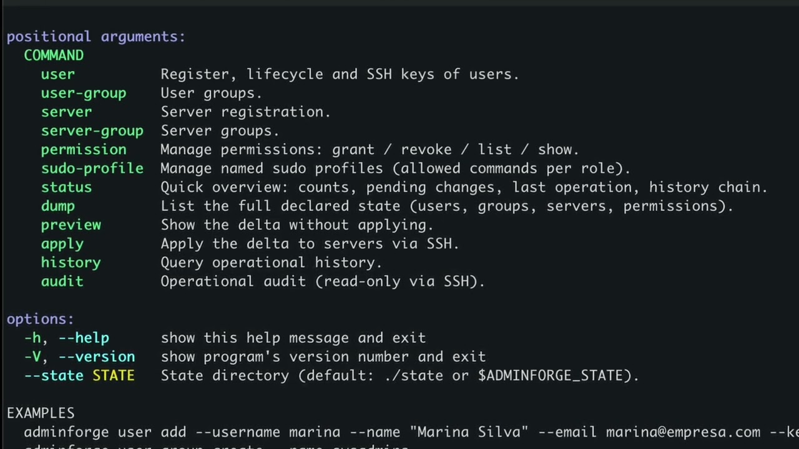

  

  <b>Open-source tools for managing Linux server fleets.</b> 
  Built at <a href="https://ai-horizon-labs.github.io/">AI Horizon Labs</a>, in Alegrete, Rio Grande do Sul, Brazil.

## Tools

### [AdminForge](https://github.com/BagualOps/adminforge)

AdminForge manages accounts, SSH keys, groups and access permissions across a fleet of Linux
servers from a single operator machine. The operator writes down the access state the fleet
should have, previews the changes that would follow from it, and applies them over SSH. Every
operation is appended to a local history in which each entry carries a hash of the entry before
it, so a later edit to the record is detectable. Nothing is installed on the managed hosts: no
agent, no resident service, only SSH.

| | |
|---|---|
| Runtime | Python 3.11 or newer, standard library only. There are no third-party packages to install, and none that can later break the tool. |
| License | AGPL-3.0-or-later |
| Published at | SBSeg 2026, Salão de Ferramentas, the open-source track of the Brazilian Symposium on Information and Computer System Security |
| Repository | [`adminforge`](https://github.com/BagualOps/adminforge), the tool and its documentation |
| Frozen artifact | [`adminforge-sbseg2026`](https://github.com/BagualOps/adminforge-sbseg2026), the paper version, with one command per claim, offline unit tests, and the reference results |

A recorded walkthrough, in Portuguese, covers installation and each command in turn.

  

The artifact's own README is the only file a reader needs: it explains how to run the minimal
test and how to reproduce each claim.

## What this organization is for

BagualOps holds the tools we build for server administration work. Each tool comes with an
artifact repository that carries its tests, its experiments, and the data behind every number
published about it, so a reader can re-run a claim instead of taking it on trust.

A *bagual* is an untamed horse of the Pampa, the grasslands of southern Brazil. That is where
the mark comes from.

## People

We work at [AI Horizon Labs](https://ai-horizon-labs.github.io/), a research group on
artificial intelligence and software engineering at the Universidade Federal do Pampa
(UNIPAMPA), on the Alegrete campus in Rio Grande do Sul, Brazil. The group is tied to the
university's graduate program in software engineering (Programa de Pós-Graduação em Engenharia
de Software, PPGES).

<table>
<tr>
<td width="140" valign="top" align="center">

</td>
<td valign="top">
<b>RUI DE QUADROS RIBEIRO</b> received the B.S. degree in computer science from the Universidade Luterana do Brasil (ULBRA) and the specialization degree in information technology management from the Universidade Federal do Rio Grande do Sul (UFRGS). He is currently pursuing the M.Sc. degree in software engineering with the Universidade Federal do Pampa (UNIPAMPA). He has been with UFRGS since 2010, as an IT analyst and then as the director of its data processing center (CPD), and works as a consultant on digital identity management. His interests include identity and access management, federated authentication, and Linux server infrastructure.
  
<a href="https://orcid.org/0000-0003-0287-9007">ORCID</a> ·
<a href="http://lattes.cnpq.br/3586977972572902">Lattes</a> ·
<a href="https://github.com/ruiribeirotk">GitHub</a> ·
<a href="https://www.linkedin.com/in/ruiribeirotk/">LinkedIn</a>
</td>
</tr>
<tr>
<td width="140" valign="top" align="center">

</td>
<td valign="top">
<b>CRISTHIAN KAPELINSKI</b> is currently pursuing the B.S. degree in computer science with the Universidade Federal do Pampa (UNIPAMPA), Alegrete, Brazil. He is a pre-master's research fellow in AI security with the LARC laboratory of the Polytechnic School, University of São Paulo (USP). He was a CNPq research fellow with the Instituto Tecnológico de Aeronáutica (ITA), on automated detection and response to cyber threats, and a research fellow with the Brazilian National Research and Education Network (RNP), where he led the development of the AnonShield and AnonLFI pseudonymization frameworks. His research interests include security, privacy, and machine learning, with emphasis on the pseudonymization of sensitive data and on attacks and defenses for large language models. He received the Best Artifact Award at SBRC 2026 and second place for best paper at WRSeg 2025.
  
<a href="https://orcid.org/0009-0005-5750-022X">ORCID</a> ·
<a href="http://lattes.cnpq.br/0100277568164430">Lattes</a> ·
<a href="https://scholar.google.com/citations?user=lV1lq-0AAAAJ">Scholar</a> ·
<a href="https://github.com/CristhianKapelinski">GitHub</a> ·
<a href="https://www.linkedin.com/in/cristhiankapelinski">LinkedIn</a>
</td>
</tr>
<tr>
<td width="140" valign="top" align="center">

</td>
<td valign="top">
<b>DIEGO LUIS KREUTZ</b> received the B.S. degree in computer science, the M.Sc. degree in production engineering, and the M.Sc. degree in informatics from the Universidade Federal de Santa Maria (UFSM), and holds a doctorate degree. He is currently a professor and researcher with the Universidade Federal do Pampa (UNIPAMPA), Alegrete, Brazil, where he has been since 2008. In 2023, he was a research fellow with the software systems and cybersecurity group, Monash University, Melbourne, Australia. He has also carried out research at LISHA, Universidade Federal de Santa Catarina, at LaSIGE, University of Lisbon, and at CritiX, University of Luxembourg. His research interests include the security of software-defined networking infrastructures, systems and data security, distributed and large-scale systems, and fault and intrusion tolerance. He is a member of IEEE, the IEEE Computer Society, ACM, EuroSys, and the Brazilian Computer Society (SBC).
  
<a href="https://orcid.org/0000-0003-0830-0238">ORCID</a> ·
<a href="http://lattes.cnpq.br/2781747995973774">Lattes</a> ·
<a href="https://scholar.google.com/citations?user=JcL8biEAAAAJ">Scholar</a> ·
<a href="https://github.com/diegokreutz">GitHub</a> ·
<a href="https://www.linkedin.com/in/diegokreutz/">LinkedIn</a>
</td>
</tr>
</table>

Lattes is the Brazilian national registry of researcher CVs, maintained by CNPq, the federal
research council.

## Citing

Every repository here carries a `CITATION.cff` file and a citation section at the end of its
README. Cite the paper the tool was published in, rather than the repository URL alone.
